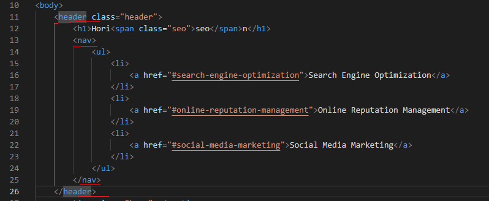
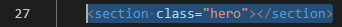
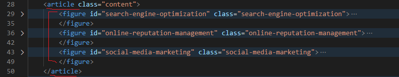
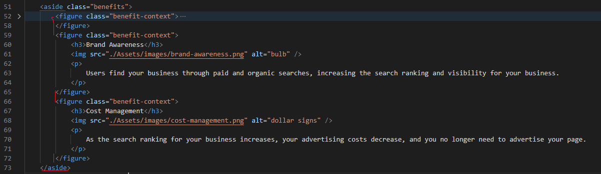
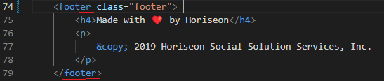
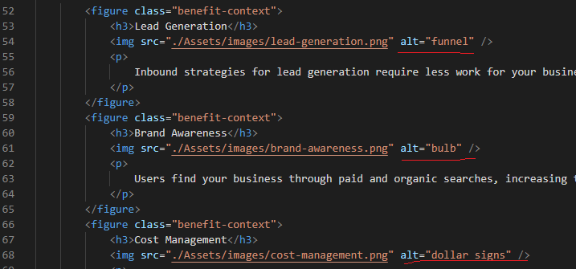
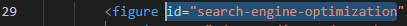
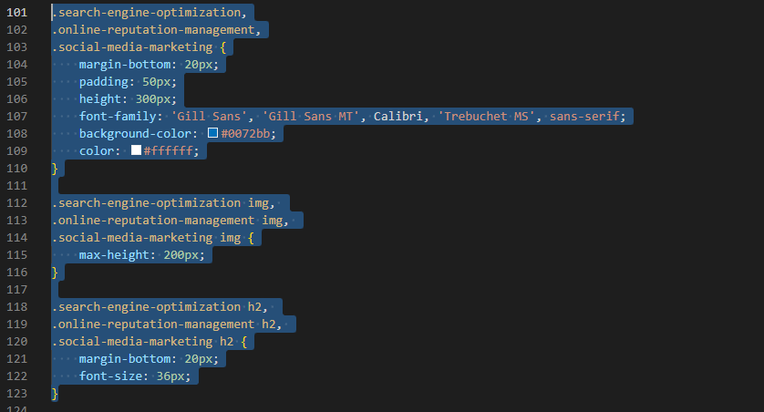

# Code Refactoring Challenge Project Summary

## Adding HTML semantic elements

* The first portion in the body section of the HTML. I added the header and nav semantic to the file since they both share being on the top of the page.

* After the header came the section semantic for the feature image of the page classed as "hero".

* Next comes the article semantic. Inside is the content. As you can see I added the figure semantic as well.

* Next comes the aside semantic. This area contains more content of the page, but on the side. Inside you see the figure semantic again as well.

* Last portion came the footer semantic. This is the very bottom content of the page.

## Adding alt attribute to image element

* In the HTML in each image source, I added the alt attribute adding my best description of the image, in case the page or browser fails and the image doesn't load. Below is a few of them from the aside section.

## Getting the failed link to work for Search Engine Optimization

* In line 29, missing was the id= attribute. All I needed to do was add it to the line to match with where I want the user to be directed to on the page.

## CSS modification via simplifying

* For the stylesheet, I noticed a handful of the class id shared the same property and values. For that, I just added the comma symbol and gathered them to share the same value.

